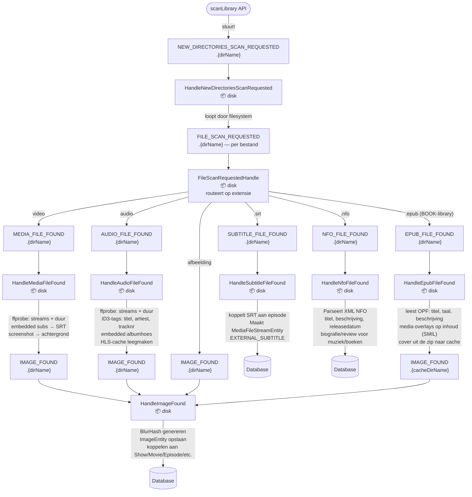
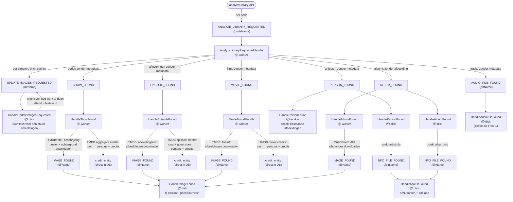
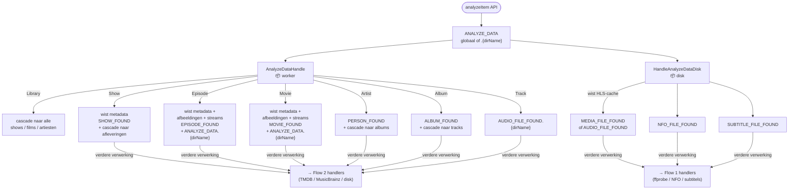
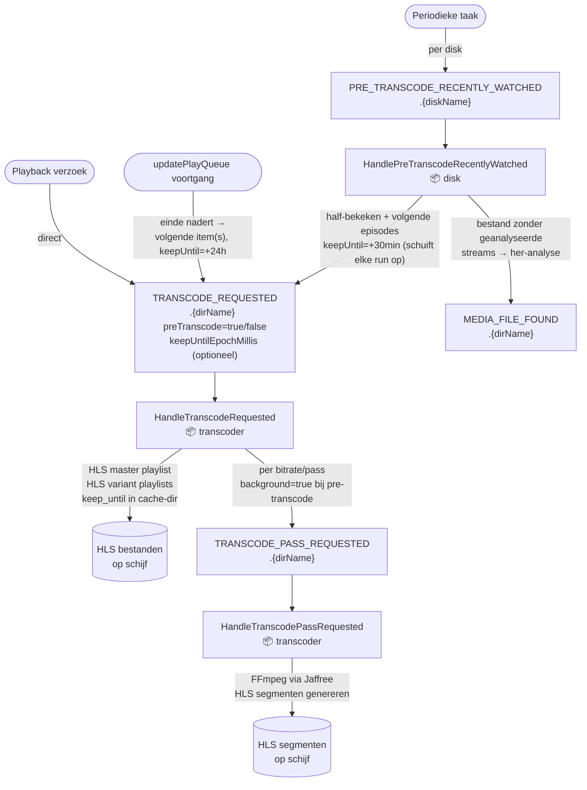
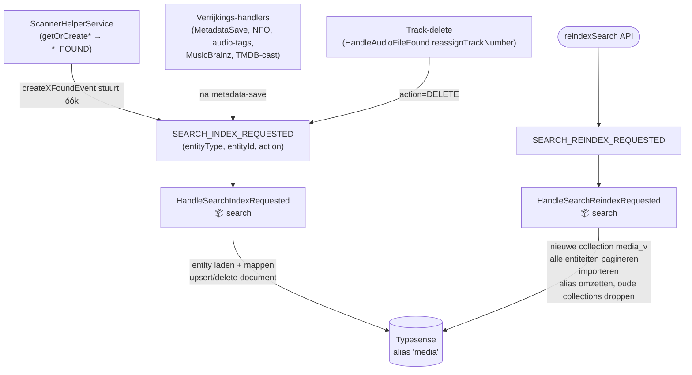

# Event Flows — Ister Server

Ister Server werkt volledig event-driven via RabbitMQ. Elke significante actie wordt asynchroon verwerkt door handlers die de `Handle<T>` interface implementeren.

**Queue-naampatroon:** `app.ister.server.<EventName>[.<scope>]`
(scope = directorynaam, nodenaam, of leeg voor globale queues)

---

## Startup

`StartupTasks` luistert op Spring's `ContextRefreshedEvent` en initialiseert de database — er worden geen RabbitMQ-events verstuurd.

---

## Flow 1: Library Scannen

**Trigger:** GraphQL mutation `scanLibrary()` in `ScannerController`

**Boeken (LibraryType BOOK):** de structuur is `Auteur/Boek.epub` en `Auteur/Boek/NNN_Hoofdstuk.mp3`.
Epubs, audiobook-mp3's, karaoke-epubs met hetzelfde (genormaliseerde) boeknaam convergeren op één
`BookEntity` (auteur = `PersonEntity`). Audiobook-mp3's volgen dezelfde `AUDIO_FILE_FOUND`-pijplijn
als muziek — `HandleAudioFileFound` brancht op library-type en koppelt `ChapterEntity` i.p.v.
`TrackEntity`. `getOrCreateBook`/`getOrCreateChapter` vuren `BOOK_FOUND`/`CHAPTER_FOUND`;
`BOOK_FOUND` wordt in de worker opgepakt voor Open Library-verrijking. Of een epub media overlays
heeft (voorleesaudio) wordt uitsluitend uit de inhoud gedetecteerd, nooit uit de bestandsnaam.

**Podcasts (LibraryType PODCAST):** het eerste feed-gebaseerde librarytype — geen library-directory
op disk. `subscribePodcast(feedUrl)` (of de uurlijkse `PodcastRefreshScheduler`, met
`lastRefreshedAt`-guard tegen dubbele sweeps op meerdere nodes) stuurt `PODCAST_REFRESH_REQUESTED`
(globale queue). De worker haalt de RSS-feed op (conditional GET met ETag/Last-Modified, cap 500
items), synct kanaal-metadata/cover en maakt `PodcastEpisodeEntity`-rijen (dedup op guid). De
nieuwste N (default 3) krijgen `PODCAST_EPISODE_DOWNLOAD_REQUESTED` op de cache-dir-queue van de
node die de refresh deed; de disk-handler downloadt de enclosure (volgt redirects) naar
`{cache}/podcasts/` en stuurt `AUDIO_FILE_FOUND`, waarna afspelen identiek is aan tracks. Oudere
afleveringen downloaden on-demand via de `downloadPodcastEpisode`-mutation. Retentie: de dagelijkse
cache-cleanup verwijdert downloads ouder dan `podcast-retention-days` (default 30), behalve als
iemand middenin de aflevering zit — de afleverings-rij blijft en kan opnieuw downloaden.

---

## Flow 2: Library Analyseren (metadata ophalen)

**Trigger:** GraphQL mutation `analyzeLibrary()` in `ScannerController`

### BlurHash-sweep

`HandleImageFound` slaat een afbeelding snel op zonder BlurHash: dat coderen is CPU-duur en maakte
die handler de bottleneck bij grote scans. De hashes worden achteraf gevuld door de
`UPDATE_IMAGES_REQUESTED`-sweep, per directory — de **cache-directory inbegrepen**, want daar staat
de gedownloade artwork en dus de overgrote meerderheid van de afbeeldingen.

Die sweep verwerkt per bericht hoogstens `app.ister.server.blur-hash.chunk-size` afbeeldingen en
publiceert daarna een opvolger met een keyset-cursor (`afterId`). Eén sweep over de hele bibliotheek
in één bericht duurde langer dan RabbitMQ's `consumer_timeout` (30 min), waarna het bericht
teruggezet werd en de sweep eindeloos opnieuw begon zonder ooit te committen.

Twee subtiliteiten:

- De cursor is een **keyset op `id`**, geen offset en geen "eerstvolgende zonder hash". Een
  afbeelding die nooit te hashen is (een CMYK-JPEG die `ImageIO` niet leest) houdt `blur_hash NULL`;
  met een simpele `LIMIT` zou de sweep zulke rijen elke ronde opnieuw pakken en nooit eindigen.
  PostgreSQL sorteert `uuid` unsigned terwijl `java.util.UUID.compareTo` signed vergelijkt, dus zowel
  de `ORDER BY` als de `id >` moeten in de database gebeuren.
- De opvolger wordt pas gepubliceerd **nadat** de chunk gecommit is (zie `BlurHashChunkProcessor`).
  Andersom zou een mislukte commit een cursor achterlaten die voorbij nooit-opgeslagen werk staat.

---

## Flow 3: Heranalyse van specifiek item

**Trigger:** GraphQL-aanroepen zoals `analyzeShow(id)`, `analyzeMovie(id)`, `analyzeEpisode(id)`, etc.

---

## Flow 4: Transcoding

**Trigger A:** Pre-transcode periodieke taak
**Trigger B:** Playback-verzoek van client
**Trigger C:** Playqueue-prefetch — `updatePlayQueue` (GraphQL) meldt voortgang; vlak voor het einde van het huidige item stuurt `PlayQueuePrefetchService` (📦 core) een `TRANSCODE_REQUESTED` (preTranscode=true) voor de volgende item(s), in de door de client gerapporteerde streamSettings.

**Prioriteit:** passes met `background=true` (pre-transcode/prefetch) draaien alleen op restcapaciteit
(`max-background-files`, `max-background-passes`) en worden gepreëmpt (FFmpeg gestopt, event vervalt —
de scheduler/prefetch stuurt later opnieuw) zodra interactieve playback een slot of thread nodig heeft.
Daarnaast draait background-FFmpeg met OS-niceness (`background-nice`, default 10, 0 = uit) via een bij
startup gegenereerd wrapper-script, zodat het ook op CPU-niveau alleen ongebruikte cycles krijgt;
ontbreekt `nice`, dan valt het automatisch terug op normale prioriteit.
Een succesvolle pass schrijft een `done_<segmentPrefix>`-marker; alleen die marker (niet de aanwezigheid
van segmenten) laat een latere pre-transcode de pass overslaan.

**Retentie:** de cleanup-taak verwijdert een cache-dir pas als hij ≥2 uur onaangeraakt is én de
`keep_until`-deadline (hoogste ooit ontvangen `keepUntilEpochMillis`) verstreken is. Prefetch stuurt
+24 uur; de periodieke pre-transcode stuurt +30 min en ververst dat elke 15 min zolang de regel geldt.

---

## Flow 5: Zoeken (Typesense)

**Trigger:** entiteit-creatie of metadata-verrijking; volledige reindex via GraphQL mutation `reindexSearch()`.
De enabled-vlag (`app.ister.typesense.enabled`) wordt **op runtime** in de handlers gecheckt (disabled →
event geconsumeerd en genegeerd, zoals de TMDB-key-check). Geen bean-conditions: die worden bij de
GraalVM native-image build bevroren.

**Regel:** elke plek die een doorzoekbare entiteit (movie/show/episode/person/album/track) verwijdert,
moet `serverEventService.createSearchDeleteEvent(...)` aanroepen. Vangnetten: de upsert-handler verwijdert
het document als de entiteit niet meer bestaat, en `reindexSearch` bouwt de index volledig opnieuw op.

---

## Volledig Event Overzicht

---

## Queue Scoping

| Scope | Events |
|-------|--------|
| **Node** `.{nodeName}` | `ANALYZE_LIBRARY_REQUESTED` |
| **Directory** `.{dirName}` | `NEW_DIRECTORIES_SCAN_REQUESTED`, `FILE_SCAN_REQUESTED`, `MEDIA_FILE_FOUND`, `AUDIO_FILE_FOUND`, `EPUB_FILE_FOUND`, `SUBTITLE_FILE_FOUND`, `IMAGE_FOUND`, `NFO_FILE_FOUND`, `UPDATE_IMAGES_REQUESTED`, `ANALYZE_DATA` (disk), `PRE_TRANSCODE_RECENTLY_WATCHED`, `TRANSCODE_REQUESTED`, `TRANSCODE_PASS_REQUESTED` |
| **Globaal** | `SHOW_FOUND`, `EPISODE_FOUND`, `MOVIE_FOUND`, `PERSON_FOUND`, `ALBUM_FOUND`, `BOOK_FOUND`, `CHAPTER_FOUND` (geen consumer), `PODCAST_FOUND` (geen consumer), `PODCAST_EPISODE_FOUND` (geen consumer), `PODCAST_REFRESH_REQUESTED`, `ANALYZE_DATA` (worker), `SEARCH_INDEX_REQUESTED`, `SEARCH_REINDEX_REQUESTED` |
| **Cache-directory** `.{nodeName}-cache-directory` | `PODCAST_EPISODE_DOWNLOAD_REQUESTED` (de download landt op de disk van die node) |

---

## Handler Referentie

| Handler | Module | Ontvangt | Verstuurt |
|---------|--------|----------|-----------|
| `HandleNewDirectoriesScanRequested` | disk | `NEW_DIRECTORIES_SCAN_REQUESTED` | `FILE_SCAN_REQUESTED` |
| `FileScanRequestedHandle` | disk | `FILE_SCAN_REQUESTED` | `MEDIA_FILE_FOUND` / `AUDIO_FILE_FOUND` / `IMAGE_FOUND` / `NFO_FILE_FOUND` / `SUBTITLE_FILE_FOUND` |
| `HandleMediaFileFound` | disk | `MEDIA_FILE_FOUND` | `IMAGE_FOUND` |
| `HandleAudioFileFound` | disk | `AUDIO_FILE_FOUND` | `IMAGE_FOUND` (track- óf chapter-gebonden, per library-type) |
| `HandleEpubFileFound` | disk | `EPUB_FILE_FOUND` | `IMAGE_FOUND` |
| `HandleSubtitleFileFound` | disk | `SUBTITLE_FILE_FOUND` | — |
| `HandleImageFound` | disk | `IMAGE_FOUND` | — |
| `HandleNfoFileFound` | disk | `NFO_FILE_FOUND` | — |
| `HandleUpdateImagesRequested` | disk | `UPDATE_IMAGES_REQUESTED` | `UPDATE_IMAGES_REQUESTED` (volgende chunk) |
| `HandleAnalyzeDataDisk` | disk | `ANALYZE_DATA` | `MEDIA_FILE_FOUND` / `AUDIO_FILE_FOUND` / `NFO_FILE_FOUND` / `SUBTITLE_FILE_FOUND` |
| `HandlePreTranscodeRecentlyWatched` | disk | `PRE_TRANSCODE_RECENTLY_WATCHED` | `TRANSCODE_REQUESTED`, `MEDIA_FILE_FOUND` (voor bestanden zonder geanalyseerde streams) |
| `HandlePersonFound` | disk | `PERSON_FOUND` | `NFO_FILE_FOUND` |
| `HandleAlbumFound` | disk | `ALBUM_FOUND` | `NFO_FILE_FOUND` |
| `AnalyzeLibraryRequestedHandle` | worker | `ANALYZE_LIBRARY_REQUESTED` | `UPDATE_IMAGES_REQUESTED`, `SHOW_FOUND`, `EPISODE_FOUND`, `MOVIE_FOUND`, `PERSON_FOUND`, `ALBUM_FOUND`, `AUDIO_FILE_FOUND` |
| `AnalyzeDataHandle` | worker | `ANALYZE_DATA` | cascade per entiteitstype |
| `HandleShowFound` | worker | `SHOW_FOUND` | `IMAGE_FOUND` (+ cast credits direct in DB) |
| `HandleEpisodeFound` | worker | `EPISODE_FOUND` | `IMAGE_FOUND` (+ cast/guest star credits direct in DB) |
| `MovieFoundHandle` | worker | `MOVIE_FOUND` | `IMAGE_FOUND` (+ cast credits direct in DB) |
| `HandlePersonFound` | worker | `PERSON_FOUND` | — |
| `HandleAlbumFound` | worker | `ALBUM_FOUND` | `IMAGE_FOUND` |
| `HandleBookFound` | worker | `BOOK_FOUND` | `IMAGE_FOUND` (Open Library-cover, alleen als er nog geen is) |
| `HandlePodcastRefreshRequested` | worker | `PODCAST_REFRESH_REQUESTED` | `IMAGE_FOUND` (feed-cover), `PODCAST_EPISODE_FOUND`, `PODCAST_EPISODE_DOWNLOAD_REQUESTED` (nieuwste N) |
| `HandlePodcastEpisodeDownloadRequested` | disk | `PODCAST_EPISODE_DOWNLOAD_REQUESTED` | `AUDIO_FILE_FOUND` (op de cache-dir-queue → ffprobe + HLS-pregeneratie) |
| `HandleTranscodeRequested` | transcoder | `TRANSCODE_REQUESTED` | `TRANSCODE_PASS_REQUESTED` |
| `HandleTranscodePassRequested` | transcoder | `TRANSCODE_PASS_REQUESTED` | — |
| `HandleSearchIndexRequested` | search | `SEARCH_INDEX_REQUESTED` | — (upsert/delete in Typesense) |
| `HandleSearchReindexRequested` | search | `SEARCH_REINDEX_REQUESTED` | — (volledige rebuild + alias-swap) |

`SEARCH_INDEX_REQUESTED` wordt verstuurd door: `ServerEventService.createXFoundEvent` (alle zes, bij creatie),
`MetadataSave` (worker, TMDB), `HandlePersonFound`/`HandleAlbumFound` (worker, MusicBrainz),
`PersonLookupService` (worker, TMDB-cast), `HandleNfoFileFound`, `HandleAudioFileFound` (incl. DELETE bij
track-dedup) en `HandlePersonFound`/`HandleAlbumFound` (disk, na metadata-delete).
