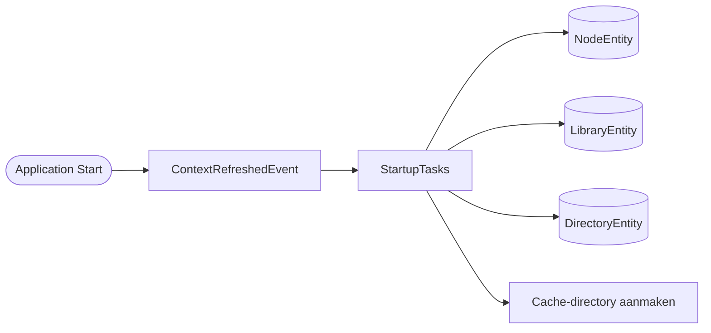
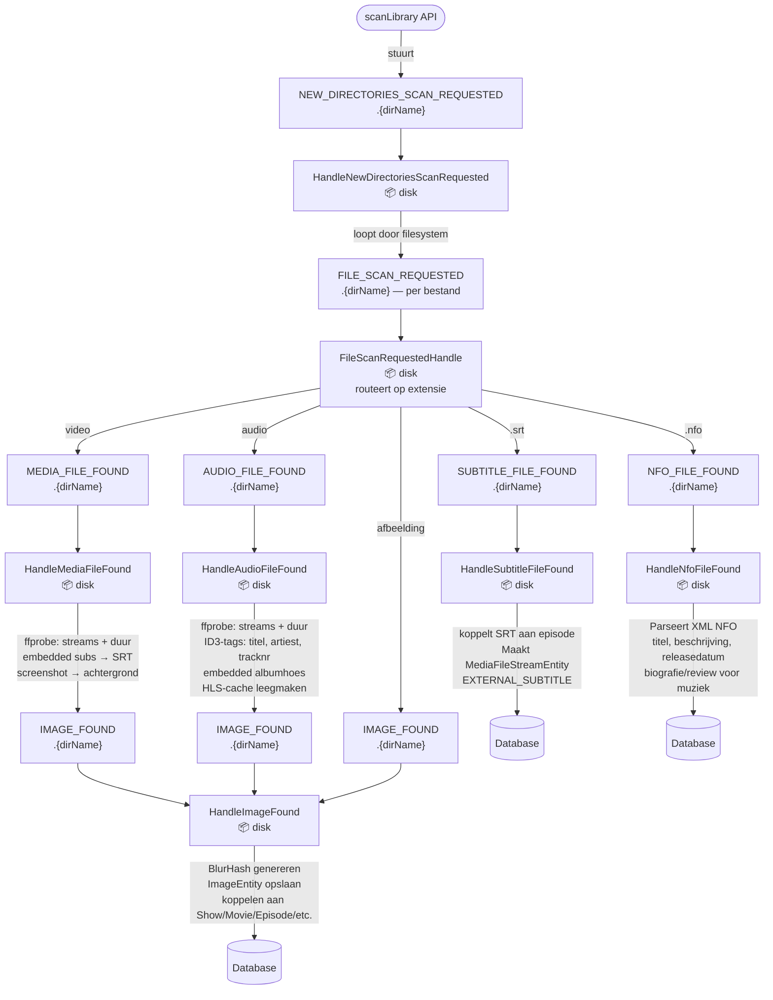
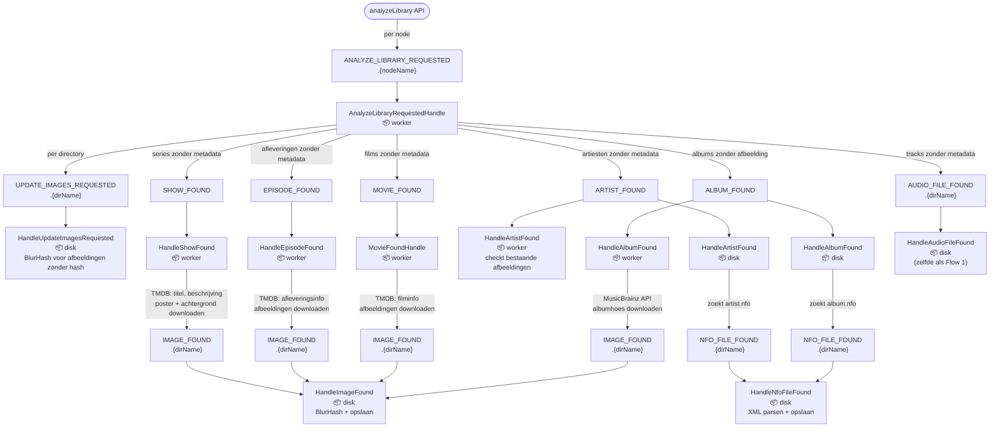
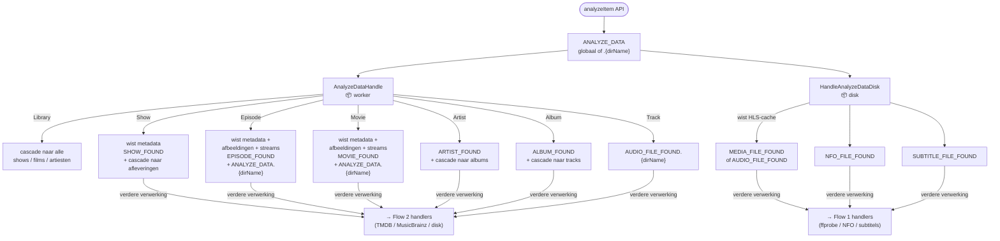
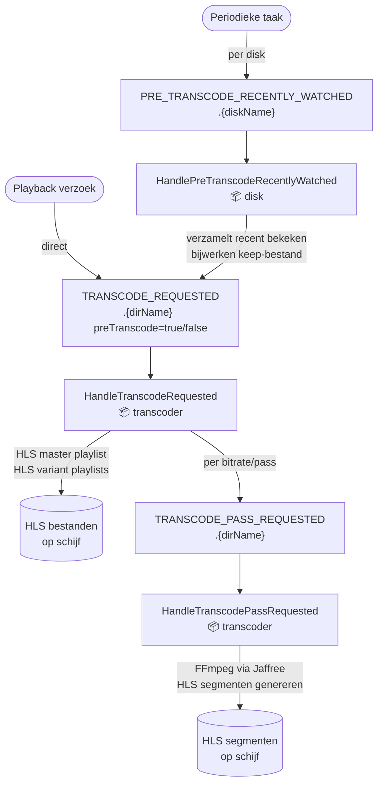
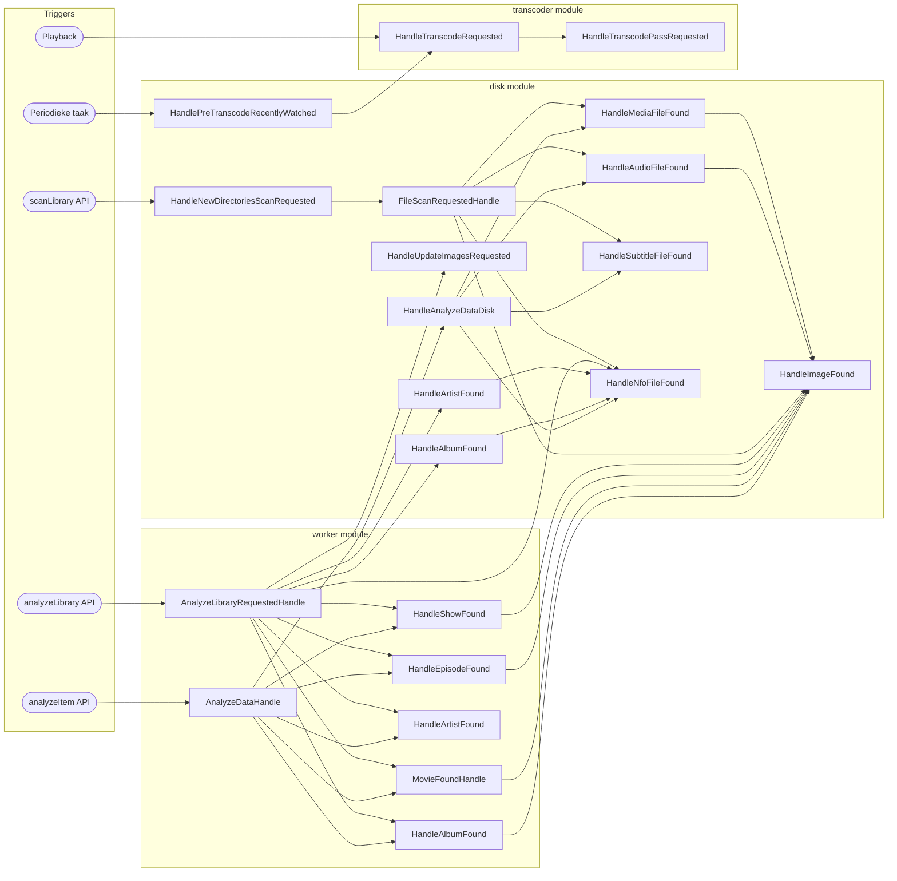

# Event Flows — Ister Server

Ister Server werkt volledig event-driven via RabbitMQ. Elke significante actie wordt asynchroon verwerkt door handlers die de `Handle<T>` interface implementeren.

**Queue-naampatroon:** `app.ister.server.<EventName>[.<scope>]`
(scope = directorynaam, nodenaam, of leeg voor globale queues)

---

## Startup

`StartupTasks` luistert op Spring's `ContextRefreshedEvent` en initialiseert de database — er worden geen RabbitMQ-events verstuurd.

---

## Flow 1: Library Scannen

**Trigger:** GraphQL mutation `scanLibrary()` in `ScannerController`

---

## Flow 2: Library Analyseren (metadata ophalen)

**Trigger:** GraphQL mutation `analyzeLibrary()` in `ScannerController`

---

## Flow 3: Heranalyse van specifiek item

**Trigger:** GraphQL-aanroepen zoals `analyzeShow(id)`, `analyzeMovie(id)`, `analyzeEpisode(id)`, etc.

---

## Flow 4: Transcoding

**Trigger A:** Pre-transcode periodieke taak
**Trigger B:** Playback-verzoek van client

---

## Volledig Event Overzicht

---

## Queue Scoping

| Scope | Events |
|-------|--------|
| **Node** `.{nodeName}` | `ANALYZE_LIBRARY_REQUESTED` |
| **Directory** `.{dirName}` | `NEW_DIRECTORIES_SCAN_REQUESTED`, `FILE_SCAN_REQUESTED`, `MEDIA_FILE_FOUND`, `AUDIO_FILE_FOUND`, `SUBTITLE_FILE_FOUND`, `IMAGE_FOUND`, `NFO_FILE_FOUND`, `UPDATE_IMAGES_REQUESTED`, `ANALYZE_DATA` (disk), `PRE_TRANSCODE_RECENTLY_WATCHED`, `TRANSCODE_REQUESTED`, `TRANSCODE_PASS_REQUESTED` |
| **Globaal** | `SHOW_FOUND`, `EPISODE_FOUND`, `MOVIE_FOUND`, `ARTIST_FOUND`, `ALBUM_FOUND`, `ANALYZE_DATA` (worker) |

---

## Handler Referentie

| Handler | Module | Ontvangt | Verstuurt |
|---------|--------|----------|-----------|
| `HandleNewDirectoriesScanRequested` | disk | `NEW_DIRECTORIES_SCAN_REQUESTED` | `FILE_SCAN_REQUESTED` |
| `FileScanRequestedHandle` | disk | `FILE_SCAN_REQUESTED` | `MEDIA_FILE_FOUND` / `AUDIO_FILE_FOUND` / `IMAGE_FOUND` / `NFO_FILE_FOUND` / `SUBTITLE_FILE_FOUND` |
| `HandleMediaFileFound` | disk | `MEDIA_FILE_FOUND` | `IMAGE_FOUND` |
| `HandleAudioFileFound` | disk | `AUDIO_FILE_FOUND` | `IMAGE_FOUND` |
| `HandleSubtitleFileFound` | disk | `SUBTITLE_FILE_FOUND` | — |
| `HandleImageFound` | disk | `IMAGE_FOUND` | — |
| `HandleNfoFileFound` | disk | `NFO_FILE_FOUND` | — |
| `HandleUpdateImagesRequested` | disk | `UPDATE_IMAGES_REQUESTED` | — |
| `HandleAnalyzeDataDisk` | disk | `ANALYZE_DATA` | `MEDIA_FILE_FOUND` / `AUDIO_FILE_FOUND` / `NFO_FILE_FOUND` / `SUBTITLE_FILE_FOUND` |
| `HandlePreTranscodeRecentlyWatched` | disk | `PRE_TRANSCODE_RECENTLY_WATCHED` | `TRANSCODE_REQUESTED` |
| `HandleArtistFound` | disk | `ARTIST_FOUND` | `NFO_FILE_FOUND` |
| `HandleAlbumFound` | disk | `ALBUM_FOUND` | `NFO_FILE_FOUND` |
| `AnalyzeLibraryRequestedHandle` | worker | `ANALYZE_LIBRARY_REQUESTED` | `UPDATE_IMAGES_REQUESTED`, `SHOW_FOUND`, `EPISODE_FOUND`, `MOVIE_FOUND`, `ARTIST_FOUND`, `ALBUM_FOUND`, `AUDIO_FILE_FOUND` |
| `AnalyzeDataHandle` | worker | `ANALYZE_DATA` | cascade per entiteitstype |
| `HandleShowFound` | worker | `SHOW_FOUND` | `IMAGE_FOUND` |
| `HandleEpisodeFound` | worker | `EPISODE_FOUND` | `IMAGE_FOUND` |
| `MovieFoundHandle` | worker | `MOVIE_FOUND` | `IMAGE_FOUND` |
| `HandleArtistFound` | worker | `ARTIST_FOUND` | — |
| `HandleAlbumFound` | worker | `ALBUM_FOUND` | `IMAGE_FOUND` |
| `HandleTranscodeRequested` | transcoder | `TRANSCODE_REQUESTED` | `TRANSCODE_PASS_REQUESTED` |
| `HandleTranscodePassRequested` | transcoder | `TRANSCODE_PASS_REQUESTED` | — |
