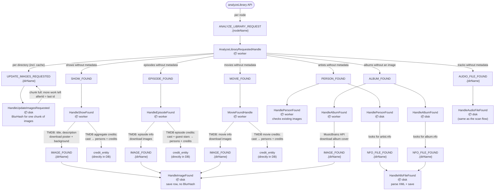
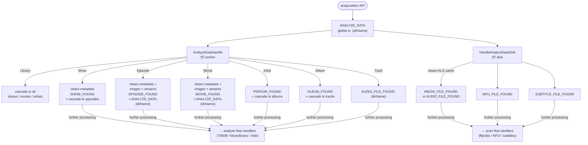

# Analyze flows (library-wide and per-item)

## Library analyze

Triggered by the GraphQL mutation `analyzeLibrary()` (`ScannerController`): metadata is fetched
for everything that lacks it, and the BlurHash sweep is kicked off per directory.

## Per-item reanalysis

Triggered by GraphQL calls such as `analyzeShow(id)`, `analyzeMovie(id)`, `analyzeEpisode(id)`, etc.

