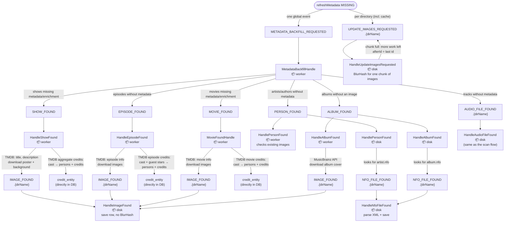
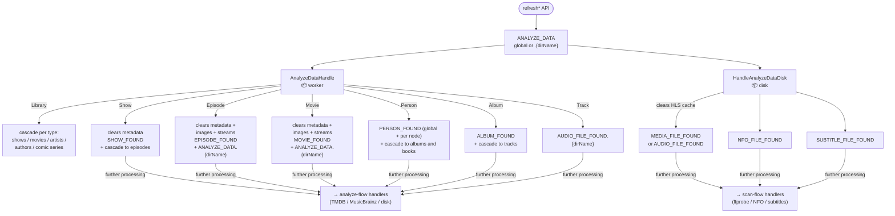

# Refresh flows (backfill and per-item force refresh)

## Metadata backfill

Triggered by the GraphQL mutation `refreshMetadata(MISSING)` (`MetadataRefreshController`):
metadata is fetched for everything that lacks it (movies/shows also when their TMDB enrichment
columns were never filled). The controller kicks the BlurHash sweep per directory itself; the
backfill event is **global**, so it runs exactly once cluster-wide.

```mermaid
flowchart TD
    API([refreshMetadata MISSING]) -->|"per directory (incl. cache)"| C["UPDATE_IMAGES_REQUESTED\n.{dirName}"]
    API -->|"one global event"| A

    A["METADATA_BACKFILL_REQUESTED"]
    A --> B["MetadataBackfillHandle\n📦 worker"]

    B -->|"shows missing metadata/enrichment"| D["SHOW_FOUND"]
    B -->|"episodes without metadata"| E["EPISODE_FOUND"]
    B -->|"movies missing metadata/enrichment"| F["MOVIE_FOUND"]
    B -->|"artists/authors without metadata"| G["PERSON_FOUND"]
    B -->|"albums without an image"| H["ALBUM_FOUND"]
    B -->|"tracks without metadata"| I["AUDIO_FILE_FOUND\n.{dirName}"]

    C --> C1["HandleUpdateImagesRequested\n📦 disk\nBlurHash for one chunk of images"]
    C1 -->|"chunk full: more work left\nafterId = last id"| C

    D --> D1["HandleShowFound\n📦 worker"]
    D1 -->|"TMDB: title, description\ndownload poster + background"| IMG1["IMAGE_FOUND\n.{dirName}"]
    D1 -->|"TMDB aggregate credits:\ncast → persons + credits"| CR1["credit_entity\n(directly in DB)"]

    E --> E1["HandleEpisodeFound\n📦 worker"]
    E1 -->|"TMDB: episode info\ndownload images"| IMG2["IMAGE_FOUND\n.{dirName}"]
    E1 -->|"TMDB episode credits:\ncast + guest stars → persons + credits"| CR2["credit_entity\n(directly in DB)"]

    F --> F1["MovieFoundHandle\n📦 worker"]
    F1 -->|"TMDB: movie info\ndownload images"| IMG3["IMAGE_FOUND\n.{dirName}"]
    F1 -->|"TMDB movie credits:\ncast → persons + credits"| CR3["credit_entity\n(directly in DB)"]

    G --> G1["HandlePersonFound\n📦 worker\nchecks existing images"]
    G --> G2["HandlePersonFound\n📦 disk"]
    G2 -->|"looks for artist.nfo"| NFO1["NFO_FILE_FOUND\n.{dirName}"]

    H --> H1["HandleAlbumFound\n📦 worker"]
    H1 -->|"MusicBrainz API\ndownload album cover"| IMG4["IMAGE_FOUND\n.{dirName}"]
    H --> H2["HandleAlbumFound\n📦 disk"]
    H2 -->|"looks for album.nfo"| NFO2["NFO_FILE_FOUND\n.{dirName}"]

    I --> I1["HandleAudioFileFound\n📦 disk\n(same as the scan flow)"]

    IMG1 & IMG2 & IMG3 & IMG4 --> FIN["HandleImageFound\n📦 disk\nsave row, no BlurHash"]
    NFO1 & NFO2 --> FIN2["HandleNfoFileFound\n📦 disk\nparse XML + save"]
```

## Force refresh (per item or per library)

Triggered by `refreshMetadata(FORCE, libraryId)` and the per-item calls `refreshShow(id)`,
`refreshMovie(id)`, `refreshEpisode(id)`, `refreshPerson(id)`, `refreshAlbum(id)`,
`refreshTrack(id)`. Destructive: stored metadata/artwork/stream info is deleted first, then
everything is re-fetched.

```mermaid
flowchart TD
    API([refresh* API]) --> A

    A["ANALYZE_DATA\nglobal or .{dirName}"]

    A --> W["AnalyzeDataHandle\n📦 worker"]
    A --> D["HandleAnalyzeDataDisk\n📦 disk"]

    W -->|Library| W1["cascade per type:\nshows / movies / artists /\nauthors / comic series"]
    W -->|Show| W2["clears metadata\nSHOW_FOUND\n+ cascade to episodes"]
    W -->|Episode| W3["clears metadata +\nimages + streams\nEPISODE_FOUND\n+ ANALYZE_DATA.{dirName}"]
    W -->|Movie| W4["clears metadata +\nimages + streams\nMOVIE_FOUND\n+ ANALYZE_DATA.{dirName}"]
    W -->|Person| W5["PERSON_FOUND (global + per node)\n+ cascade to albums and books"]
    W -->|Album| W6["ALBUM_FOUND\n+ cascade to tracks"]
    W -->|Track| W7["AUDIO_FILE_FOUND.{dirName}"]

    D -->|"clears HLS cache"| D1["MEDIA_FILE_FOUND\nor AUDIO_FILE_FOUND"]
    D --> D2["NFO_FILE_FOUND"]
    D --> D3["SUBTITLE_FILE_FOUND"]

    W2 & W3 & W4 & W5 & W6 & W7 -->|"further processing"| FLOWS["→ analyze-flow handlers\n(TMDB / MusicBrainz / disk)"]
    D1 & D2 & D3 -->|"further processing"| FLOWS2["→ scan-flow handlers\n(ffprobe / NFO / subtitles)"]
```
