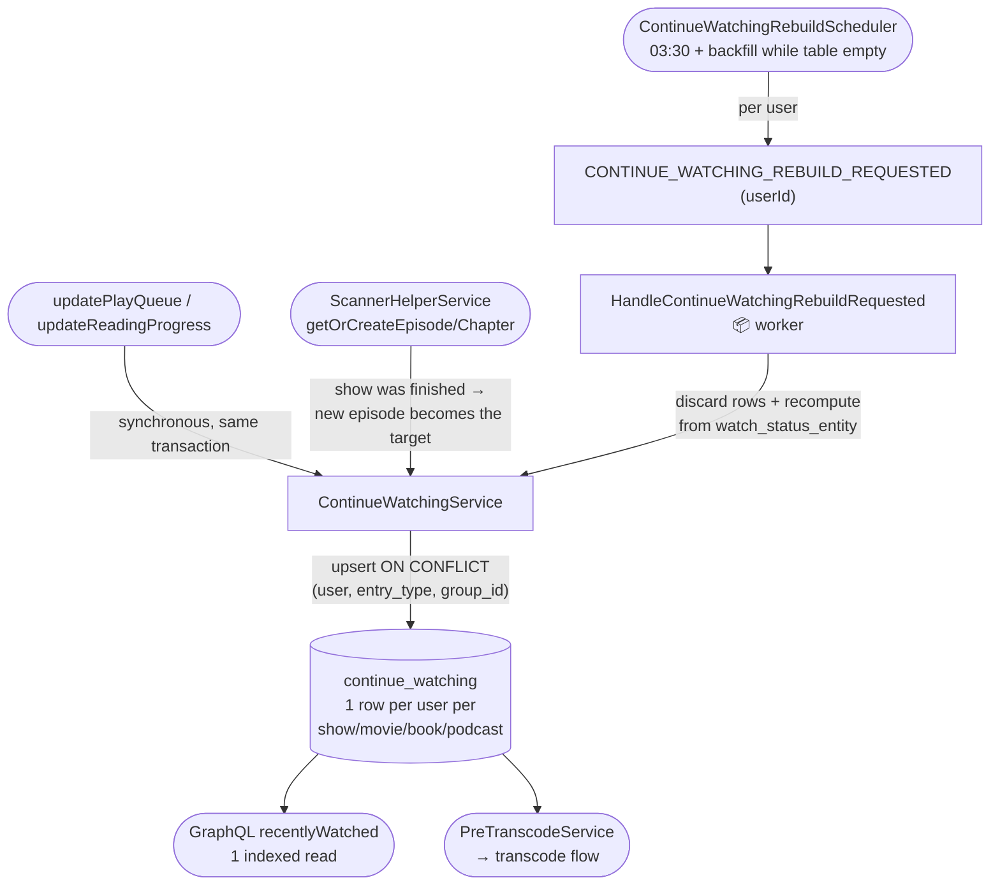

# Continue-watching flow

The `recentlyWatched` list is precomputed. Heartbeats update the `continue_watching` table
synchronously in the same transaction as the watch-status write; a nightly per-user rebuild keeps
it self-healing; and the scanner recomputes a show/book when a new episode/chapter appears.

