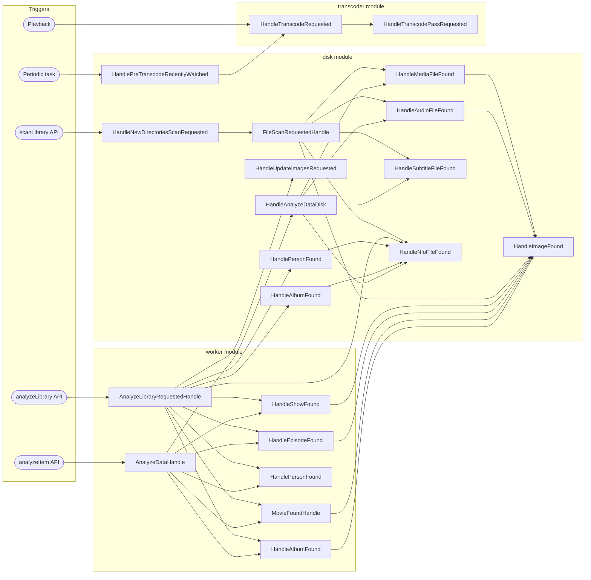

# Full event overview

All handlers by module and how the main triggers fan out through them. See the per-flow diagrams
for the details of each path.

```mermaid
graph LR
    subgraph Triggers
        T1([scanLibrary API])
        T2([analyzeLibrary API])
        T3([analyzeItem API])
        T4([Periodic task])
        T5([Playback])
    end

    subgraph disk module
        H1[HandleNewDirectoriesScanRequested]
        H2[FileScanRequestedHandle]
        H3[HandleMediaFileFound]
        H4[HandleAudioFileFound]
        H5[HandleSubtitleFileFound]
        H6[HandleImageFound]
        H7[HandleNfoFileFound]
        H8[HandleUpdateImagesRequested]
        H9[HandleAnalyzeDataDisk]
        H10[HandlePreTranscodeRecentlyWatched]
        H11[HandlePersonFound]
        H12[HandleAlbumFound]
    end

    subgraph worker module
        W1[AnalyzeLibraryRequestedHandle]
        W2[AnalyzeDataHandle]
        W3[HandleShowFound]
        W4[HandleEpisodeFound]
        W5[MovieFoundHandle]
        W6[HandlePersonFound]
        W7[HandleAlbumFound]
    end

    subgraph transcoder module
        TR1[HandleTranscodeRequested]
        TR2[HandleTranscodePassRequested]
    end

    T1 --> H1 --> H2
    H2 --> H3 --> H6
    H2 --> H4 --> H6
    H2 --> H5
    H2 --> H6
    H2 --> H7

    T2 --> W1
    W1 --> H8
    W1 --> W3 --> H6
    W1 --> W4 --> H6
    W1 --> W5 --> H6
    W1 --> W6
    W1 --> W7 --> H6
    W1 --> H7
    W1 --> H11 --> H7
    W1 --> H12 --> H7

    T3 --> W2
    W2 --> W3 & W4 & W5 & W6 & W7
    W2 --> H9
    H9 --> H3 & H4 & H7 & H5

    T4 --> H10 --> TR1 --> TR2
    T5 --> TR1
```
