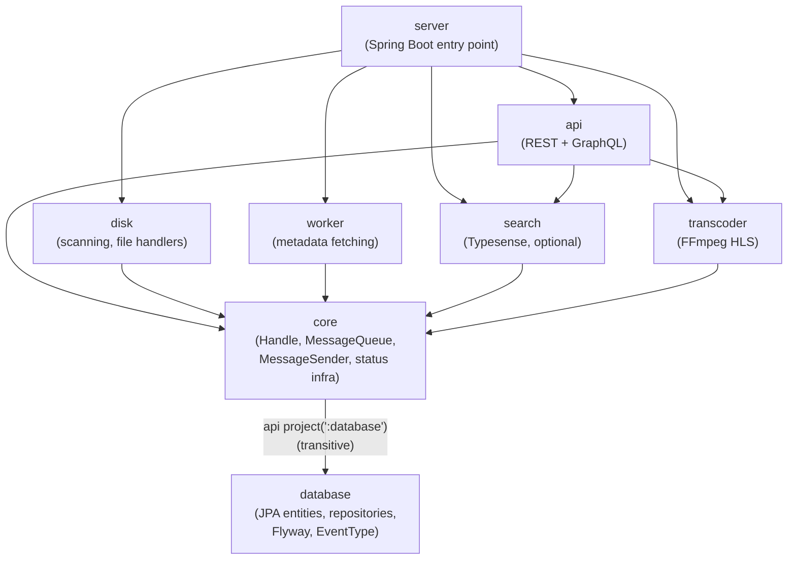

# Module dependency flow

`server` is the Spring Boot entry point and pulls in every feature module. Feature modules depend
only on `core`, which re-exports `database` (entities, repositories, `EventType`) transitively via
`api project(':database')`. `database` depends on nothing internal — nothing may reverse that
direction. Note that `core` and `database` both contribute to the `app.ister.core.*` package
(a split package).

