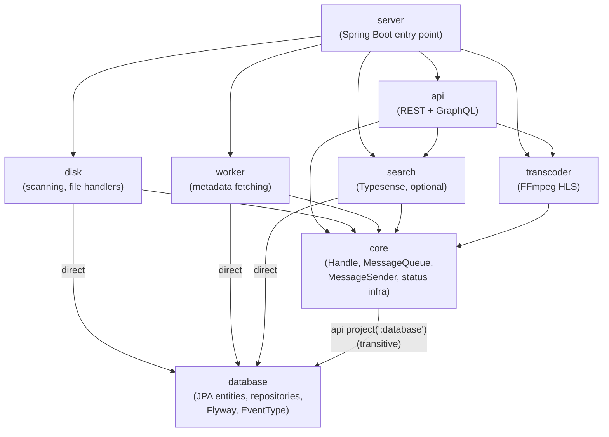

# Module dependency flow

`server` is the Spring Boot entry point and pulls in every feature module. Every feature module
depends on `core`, which re-exports `database` (entities, repositories, `EventType`) transitively
via `api project(':database')`; `disk`, `worker` and `search` additionally declare a direct
`database` dependency (`api` and `transcoder` rely on the transitive export). Either way the
direction is the same: `database` depends on nothing internal — nothing may reverse that
direction. Note that `core` and `database` both contribute to the `app.ister.core.*` package
(a split package).

```mermaid
flowchart TD
    server["server\n(Spring Boot entry point)"]
    api["api\n(REST + GraphQL)"]
    disk["disk\n(scanning, file handlers)"]
    worker["worker\n(metadata fetching)"]
    search["search\n(Typesense, optional)"]
    transcoder["transcoder\n(FFmpeg HLS)"]
    core["core\n(Handle, MessageQueue,\nMessageSender, status infra)"]
    database["database\n(JPA entities, repositories,\nFlyway, EventType)"]

    server --> api & disk & worker & search & transcoder
    api --> search
    api --> transcoder
    api & disk & worker & search & transcoder --> core
    disk & worker & search -->|direct| database
    core -->|"api project(':database')\n(transitive)"| database
```
