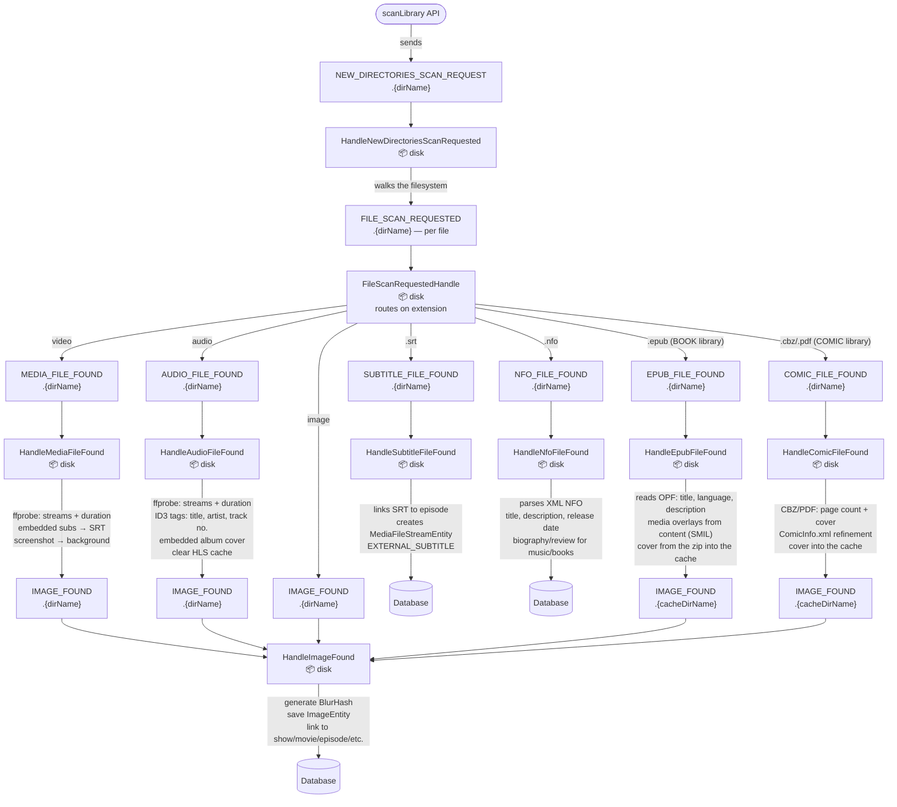

# Library scan flow

Triggered by the GraphQL mutation `scanLibrary()` (`ScannerController`). The directory walk fans
out into one `FILE_SCAN_REQUESTED` per file, which routes on extension to the type-specific
handlers.

