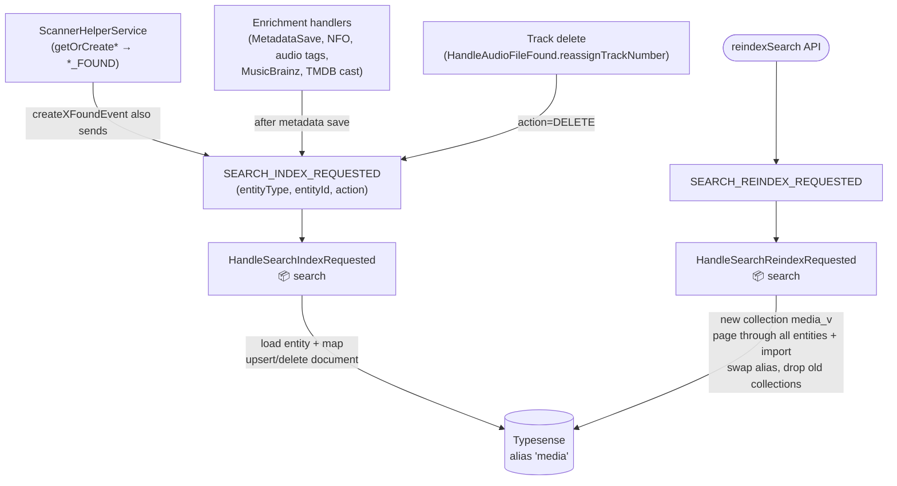

# Search flow (Typesense)

Index updates are event-driven: entity creation and every metadata enrichment emit
`SEARCH_INDEX_REQUESTED`; a full rebuild goes through `SEARCH_REINDEX_REQUESTED` with an alias
swap so search stays live during the rebuild.

