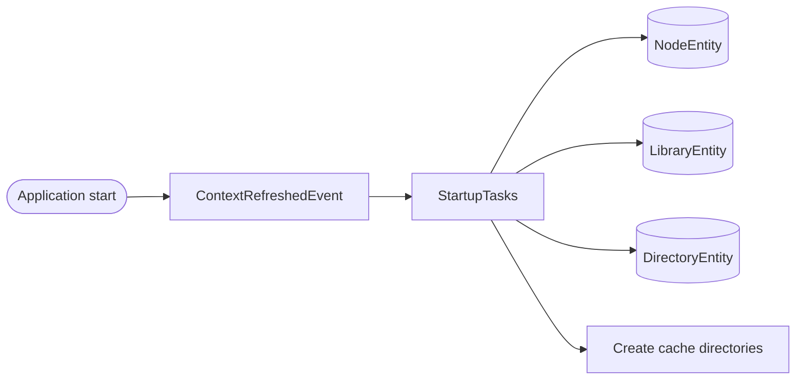

# Startup initialization

`StartupTasks` listens for Spring's `ContextRefreshedEvent` and initializes the database — no
RabbitMQ events are sent during startup.

```mermaid
flowchart LR
    A([Application start]) --> B[ContextRefreshedEvent]
    B --> C[StartupTasks]
    C --> D[(NodeEntity)]
    C --> E[(LibraryEntity)]
    C --> F[(DirectoryEntity)]
    C --> G[Create cache directories]
```
