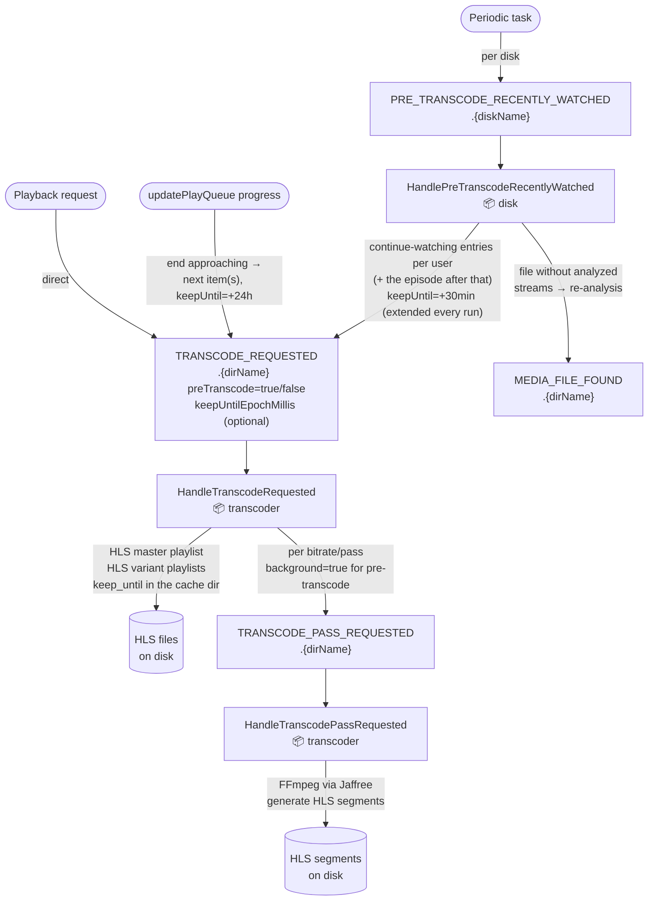

# Transcode flow

Three triggers feed the same `TRANSCODE_REQUESTED` queue: the periodic pre-transcode task, an
interactive playback request, and the play-queue prefetch (which requests the next item(s) shortly
before the current one ends, in the client's reported stream settings).

