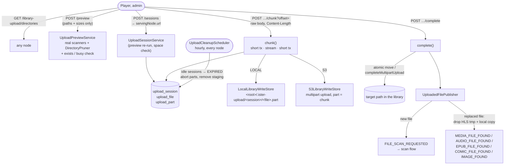

# Upload flow

An admin upload writes files into a library directory and hands each finished file to the normal
scan pipeline. The preview and the scan share one decision (`Scanners.analyzableBy` +
`DirectoryPruner`), the bytes never pass through RabbitMQ, and the chunks go straight to the node
that can write the directory.

